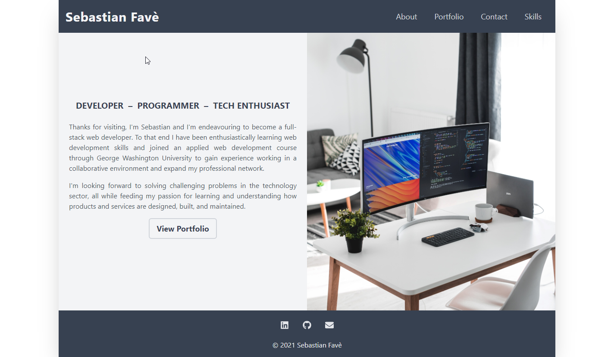

# **Personal Portfolio Website**

&nbsp;
## **Description**
This repository holds the source files for the personal portfolio website of Sebastian Favè. This portfolio is built using React and Tailwind CSS. 

&nbsp;
## **[React Portfolio](https://spfave.github.io/portfolio-react)**

&nbsp;
## **Technologies and Services**
Web Technologies/Design
- HTML5, JSX
- Responsive Design

External Frameworks and Services
- [React](https://reactjs.org/)
- [Tailwind CSS](https://tailwindcss.com/)

